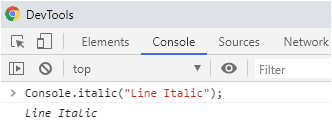
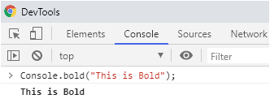
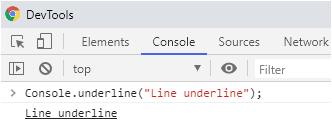
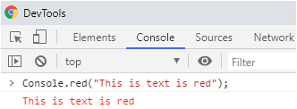
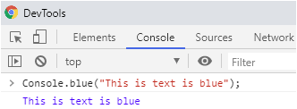
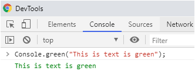

# Console.log() with styles

## How to Install
``` HTML
<script src="console.style.js"></script>
```

## How to use

### Italic
``` javascript
Console.italic("Line Italic");
```



### Bold
``` javascript
Console.bold("Line Bold");
```



### Underline
``` javascript
Console.underline("Line underline");
```



### Text Red
``` javascript
Console.red("Line red");
```



### Text Blue
``` javascript
Console.blue("Line blue");
```



### Text Green
``` javascript
Console.green("Line green");
```
