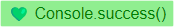
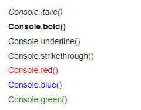
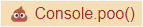
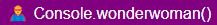

# console-cool


`Console.cool` is a JavaScript library designed to enhance and customize the debugging and logging experience in the browser console. It provides several functions and styles that go beyond the standard JavaScript console capabilities, allowing developers to not only debug their code more effectively, but also to do so in a visually appealing and organized manner.


## How use

Don't forget use first letter **C** uppercase `Console.option(value);`

``` js
// Don't forget uppercase in the first letter
import Console from './console.cool.js';
```

## Status Console

**Success**



```javascript
Console.success("Line type Success");
```

**Info**


```javascript
Console.info("Line type Info");
```
**Warning**


```javascript
Console.warn("Line type warning");
```

**Error**


## Format Console



```javascript
Console.error("Line type error");
```

**Italic**

```javascript
Console.italic("Line Italic");
```

**Bold**

```javascript
Console.bold("Line Bold");
```

**Underline**

```javascript
Console.underline("Line underline");
```

**Text Red**

```javascript
Console.red("Line red");
```

**Text Blue**

```javascript
Console.blue("Line blue");
```

**Text Green**

```javascript
Console.green("Line green");
```

## Nerd Console

**Poo**



```javascript
Console.poo("Nerd Time: poo");
```

**Gandalf**


```javascript
Console.gandalf("Nerd Time: gandalf");
```

**WonderWoman**



```javascript
Console.wonderwoman("Nerd Time: wonderwoman");
```


