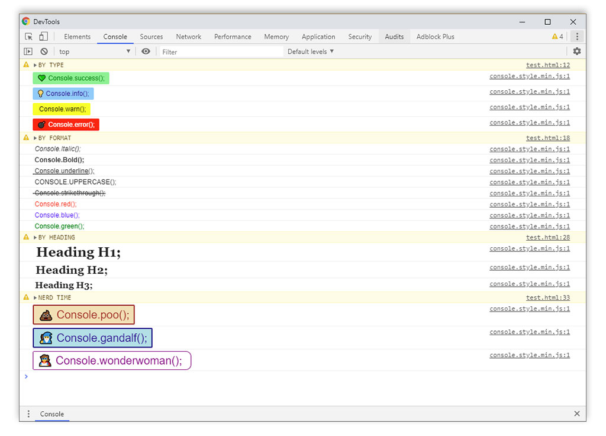

# Console.log() with styles


## How to Install
``` HTML
<script src="console.style.min.js"></script>
```

## How to use
Don't forget use first letter **C** with uppercase `Console.option("text");`


## Console by type

### Success
``` javascript
Console.success("Line type Success");
```


### Info
``` javascript
Console.info("Line type Info");
```


### Warning
``` javascript
Console.warning("Line type warning");
```


### Error
``` javascript
Console.error("Line type error");
```


## Console by Format

### Italic
``` javascript
Console.italic("Line Italic");
```


### Bold
``` javascript
Console.bold("Line Bold");
```


### Underline
``` javascript
Console.underline("Line underline");
```


### Text Red
``` javascript
Console.red("Line red");
```

### Text Blue
``` javascript
Console.blue("Line blue");
```

### Text Green
``` javascript
Console.green("Line green");
```

## Console Nerd

### Poo
``` javascript
Console.poo("Nerd Time: poo");
```

### Gandalf
``` javascript
Console.gandalf("Nerd Time: gandalf");
```
### WonderWoman
``` javascript
Console.wonderwoman("Nerd Time: wonderwoman");
```